**📄 Invoice Management Web Application**

**Overview**

Welcome to the Invoice Management Web Application! This application is
designed to help businesses manage their invoices, customer details, and
stock items efficiently. Built with a robust stack of technologies, it
ensures a seamless experience for managing your business operations.

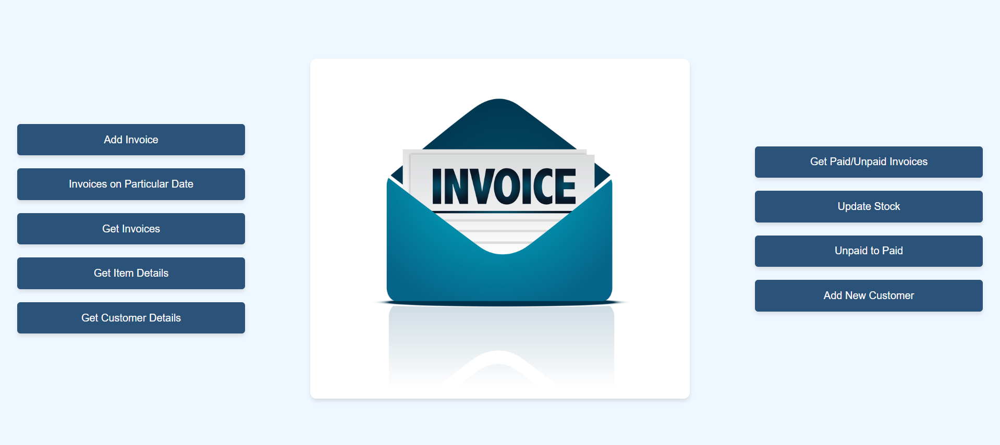

**Features**

-   📋 **Customer Management:** Add, view, and update customer details.

-   🧾 **Invoice Management:** Create, view, and update invoices.

-   💸 **Payment Tracking:** Track paid and unpaid invoices.

-   📦 **Stock Management:** Manage stock items, including adding new
    items and updating quantities.

-   📊 **Sales Reporting:** View item details, quantities sold, and
    total sales.

**Technologies Used**

-   **Frontend:** HTML, CSS, JavaScript, JSP (JavaServer Pages)

-   **Backend:** Java, MySQL, JDBC

-   **Server:** Apache Tomcat

-   **Local Development Environment:** XAMPP

**Prerequisites**

Before you begin, ensure you have the following installed:

-   [JDK (Java Development
    Kit)](https://www.oracle.com/java/technologies/javase-downloads.html)

-   [Apache Tomcat](http://tomcat.apache.org/)

-   XAMPP (which includes MySQL)

**Installation**

**1. Clone the Repository**

git clone https://github.com/ShenbagaPriya6/invoicemanagementsystem.git

cd invoicemanagement

**2. Set Up the MySQL Database**

**Start XAMPP:**

-   Open XAMPP Control Panel.

-   Start Apache and MySQL.

**Create Database:**

CREATE DATABASE invoicemanagement;

USE invoicemanagement;

**Table Design:**

Customer table:

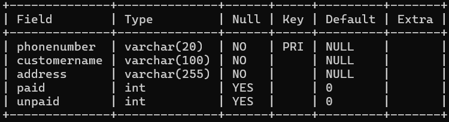

Invoice table:

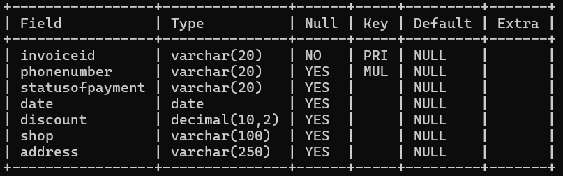

Bill_item table:

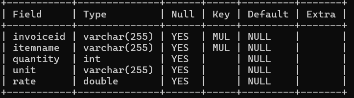

Instock table:

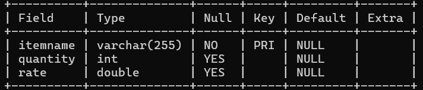

Create the above tables

**3. Configure the Database Connection**

-   Update the database connection details in your project configuration
    file (typically located in src/main/resources or directly in the
    Java code). Example:

// Example configuration in Java

String url = \"jdbc:mysql://localhost:3306/invoicemanagement\";

String username = \"root\";

String password = \"\*\*\*\*\*\";

**4. Build and Deploy the Project**

-   Use your Java IDE to build the project.

-   Deploy the project to Apache Tomcat:

> Copy the project folder to the webapps directory of your Tomcat
> installation.

**5. Start Apache Tomcat**

-   Start Apache Tomcat through the XAMPP Control Panel or command line.

**6. Access the Application**

-   Open your web browser and navigate to
    <http://localhost:8080/invoicemanagement>.

**Modules Description:**

**1. Add Invoice**

-   Enter customer details, invoice id(autogenerated), invoice date
    (autogenerated), shop name, and discount.

-   Checks whether the Customer account is already present before
    inserting into the database

-   Submit the form to create a new invoice in the database, this also
    updates the customer table (paid /unpaid amount), bill items are
    included in bill_item table and quantity is updated in the stock
    table.

-   Price of the item, Invoice total and subtotal are calculated
    dynamically using JavaScript

> 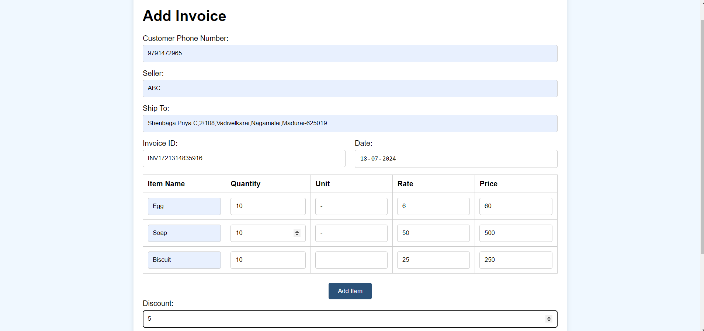
> 
**2.Bills Placed Between Particular Dates**

-   Select a specific date to see all invoices issued on that day.

-   Provides a list of invoices with details such as invoice ID,
    customer information, and amount.

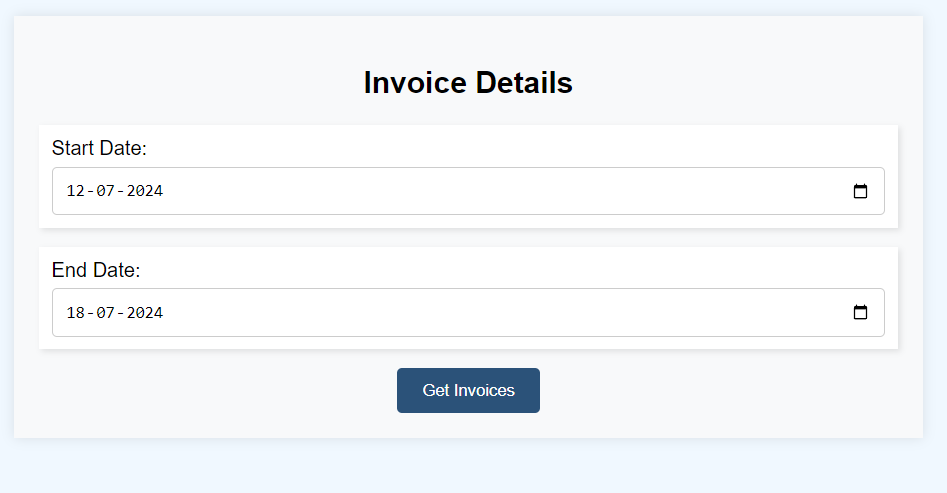

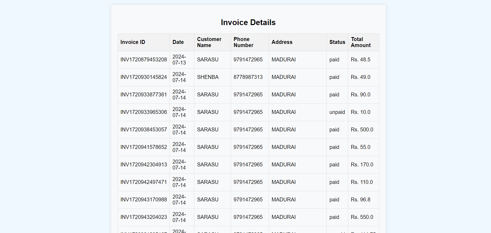

**3. Get Invoice Details**

-   Enter an invoice ID or select from a list to view detailed
    information.

-   Displays invoice items, quantities, rates, and total amount.

-   Download the Invoice

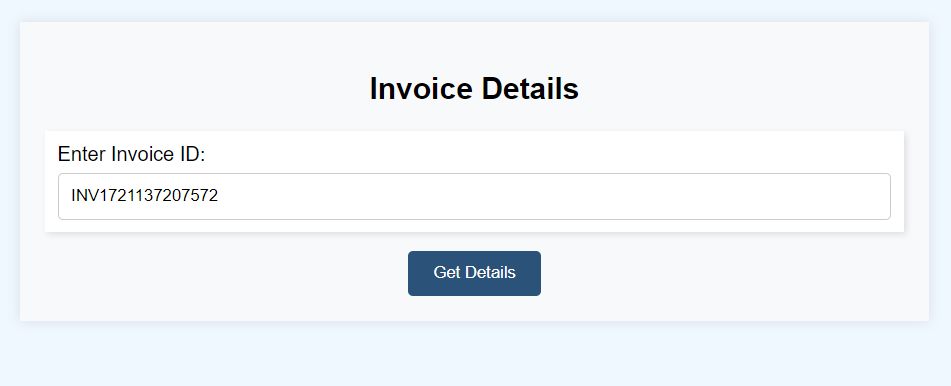

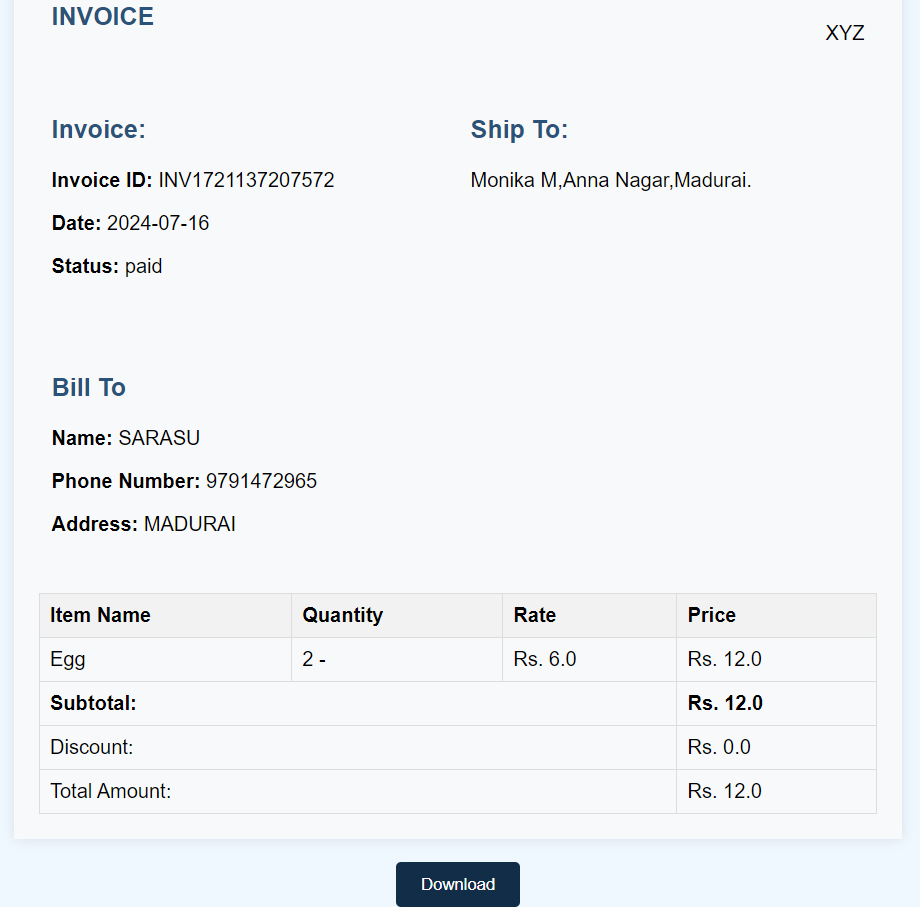

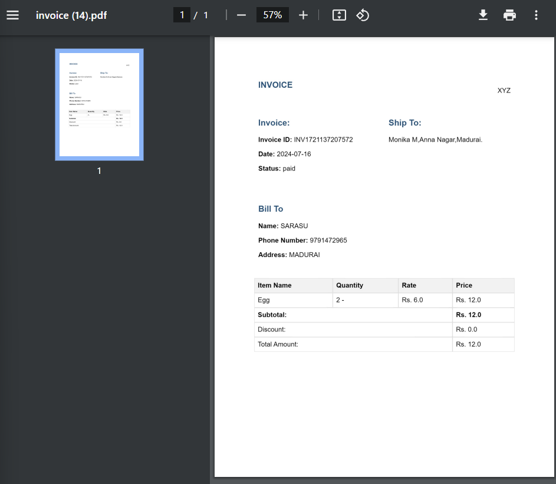

**4.Get Item Details**

-   Search for an item by name to view current stock details.

-   Shows quantity available, rate, and other relevant information.

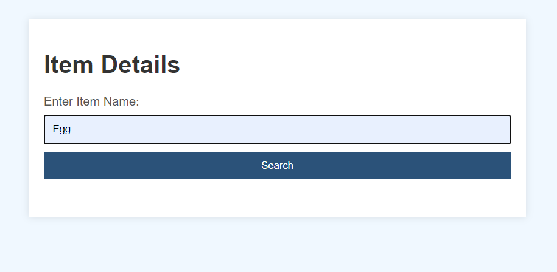
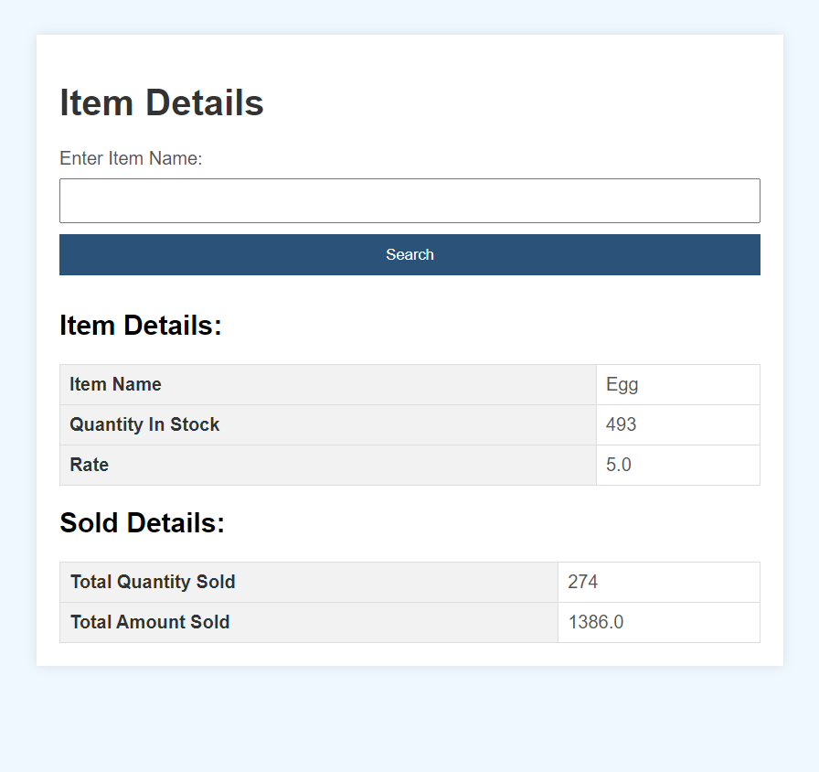

**5.Get Customer Details**

-   Enter customer phone number or select from a list to view payment
    history.

-   Shows total paid and unpaid amounts for the customer.

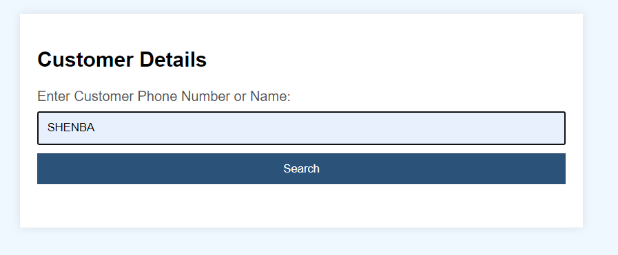
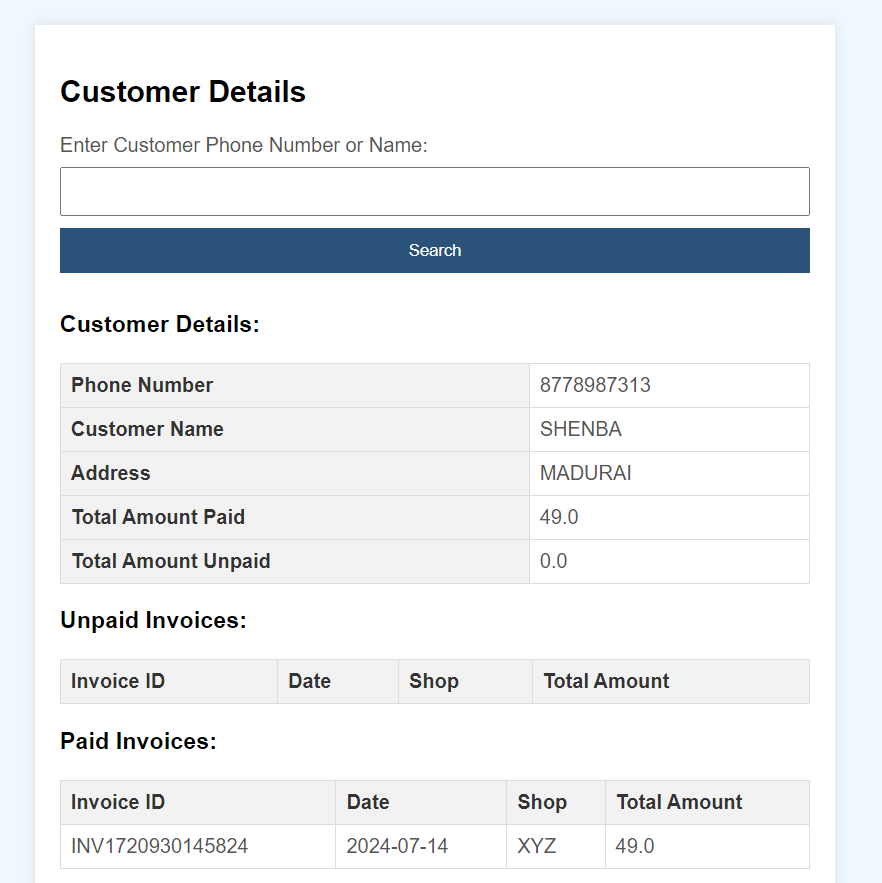

**6.View All Paid and Unpaid Invoices**

-   Filter invoices based on payment status (paid or unpaid).

-   Lists invoices with basic details like invoice ID, customer details,
    and payment status.

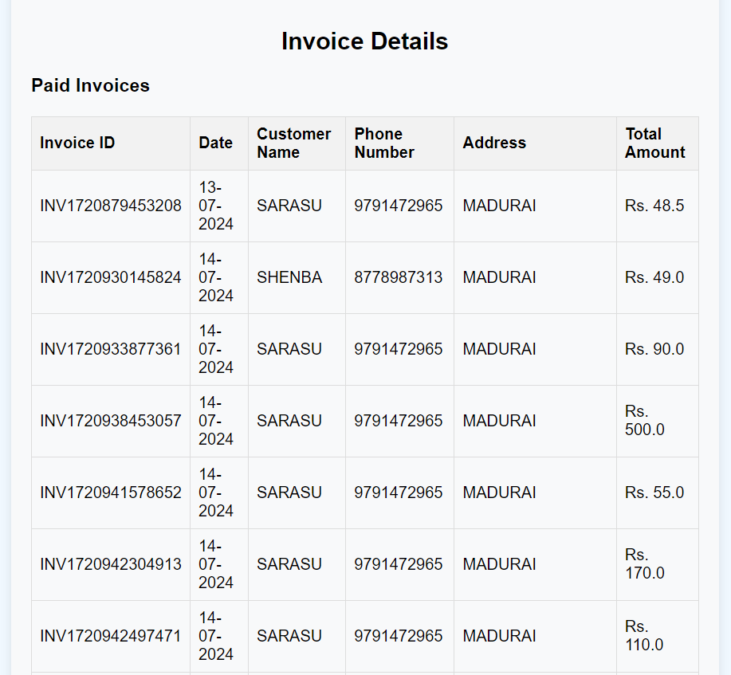
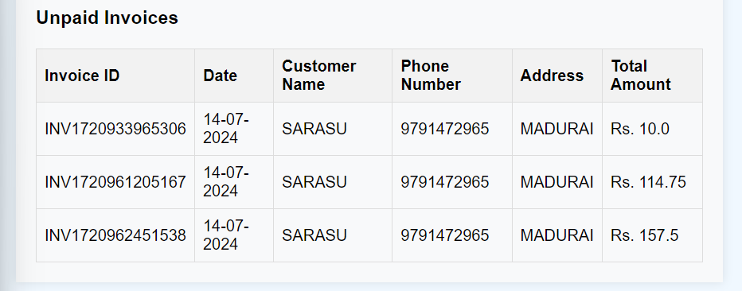

**7.Add Stock**

-   Add new items or update existing item quantities.

-   Requires entering item details such as name, quantity, and rate.

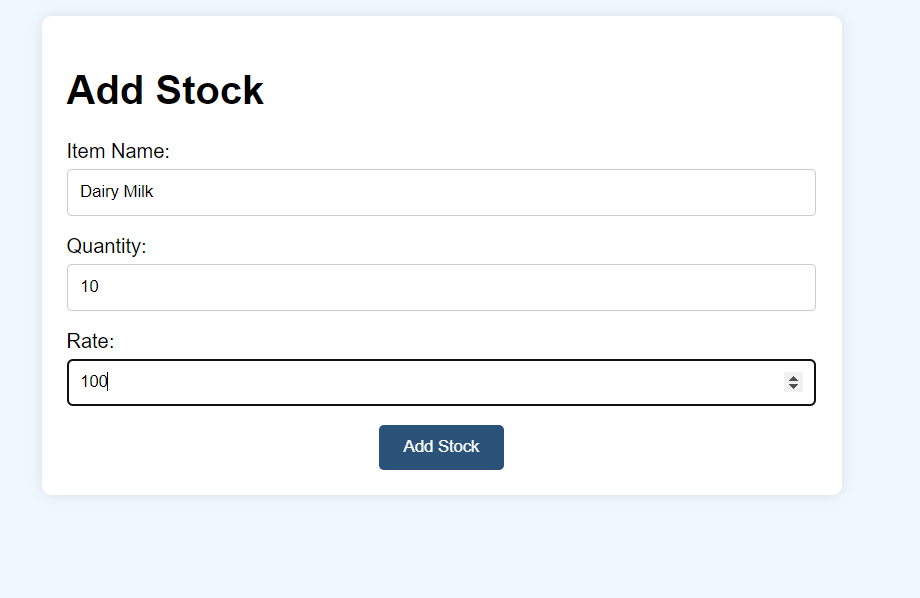
Quantity get updated in the database

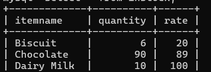

**8.Unpaid to Paid Invoices**

-   Select unpaid invoices to mark them as paid.

-   Updates the payment status in the database.

-   Updates the payment in Customer table.

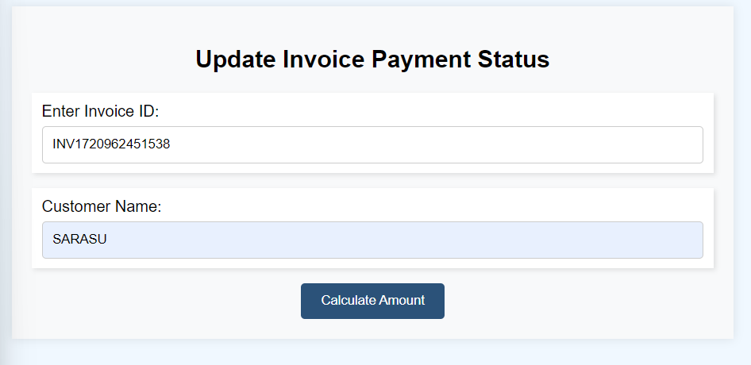
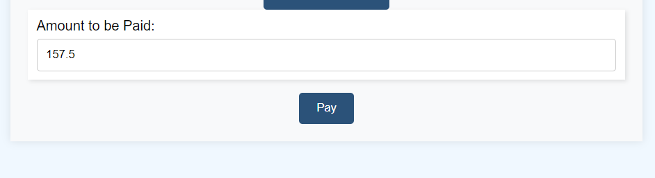

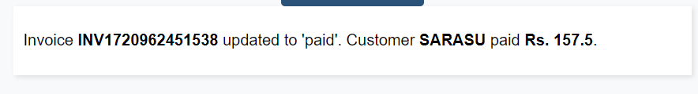

**Contact**

**For any questions or support, please contact:**

-   [**shenbagapriya2606@gmail.com**](shenbagapriya2606@gmail.com)

-   **GitHub:**
    **[https://github.com/ShenbagaPriya6](https://github.com/ShenbagaPriya6%20)**
